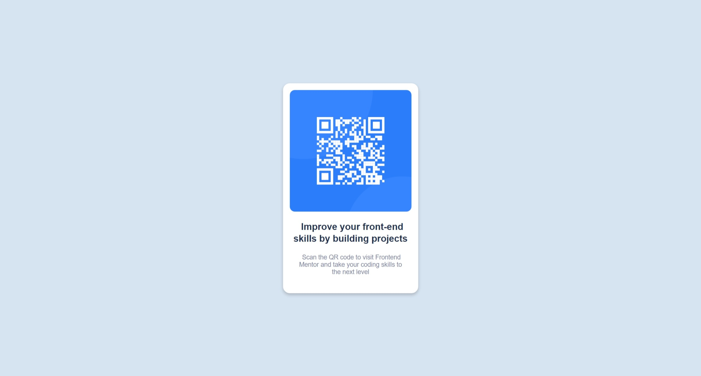

# Frontend Mentor - QR code component solution

This is a solution to the [QR code component challenge on Frontend Mentor](https://www.frontendmentor.io/challenges/qr-code-component-iux_sIO_H). Frontend Mentor challenges help you improve your coding skills by building realistic projects. 

## Table of contents

- [Overview](#overview)
  - [Screenshot](#screenshot)
  - [Links](#links)
- [My process](#my-process)
  - [Built with](#built-with)
  - [What I learned](#what-i-learned)
  - [Continued development](#continued-development)
- [Author](#author)

**Note: Delete this note and update the table of contents based on what sections you keep.**

## Overview

### Screenshot




### Links

- GITHUB repo URL: [click here](https://github.com/AyoubZ00/qr-code-component)

## My process

### Built with

- Semantic HTML5 markup
- CSS custom properties
- Flexbox

### What I learned

Before, I used to question the widespread use of divs in every frontend project, seeing 
as it is not a semantic tag. Only when you begin styling -- specifically outlining -- that you see the benefit of it, especially
when for its most common uses cases, like a container for shared properties.

```css
@import url("https://fonts.google.com/specimen/Outfit");
h3 {
  font-family: 'Outfit', sans-serif;
}
```
You can import custom fonts and use them with ease.
```css
h3::first-letter{
  padding-left: 8px;
}
```
helps in giving indentation to first letter of a word or a phrase.

### Continued development

I'm going to continue to improve my native CSS skills. 

## Author

- Github - [Ayoub](https://github.com/AyoubZ00)
- Frontend Mentor - [@AyoubZ00](https://www.frontendmentor.io/profile/AyoubZ00)